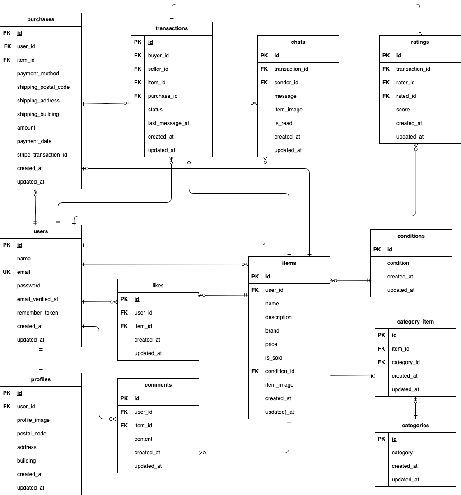

# flea-market-app


## 概要
ある企業が開発した独自のフリマアプリ


## 環境構築
**Dockerビルド**
1. `git clone git@github.com:kvujic/flea-market-app.git`
2. `cd flea-market-app`
3. DockerDesktopアプリを立ち上げる
4. `docker-compose up -d --build`

> *MacのM1・M2チップのPCの場合、`no matching manifest for linux/arm64/v8 in the manifest list entries`のメッセージが表示されビルドができないことがあります。
エラーが発生する場合は、docker-compose.ymlファイルの「mysql」内に「platform」の項目を追加で記載してください*
``` bash
mysql:
    platform: linux/x86_64(この文追加)
    image: mysql:8.0.26
    environment:
```

**Laravel環境構築**

1. `docker-compose exec php bash`
2. `composer install`
3. 「.env.example」ファイルを「.env」ファイルに命名を変更。または、新しく.envファイルを作成
```bash
cp .env.example .env
```
4. .envに以下の環境変数を追加
``` text
#データベース設定
DB_CONNECTION=mysql
DB_HOST=mysql
DB_PORT=3306
DB_DATABASE=laravel_db
DB_USERNAME=laravel_user
DB_PASSWORD=laravel_pass

# メール設定（MailHog）
MAIL_MAILER=smtp
MAIL_HOST=mailhog
MAIL_PORT=1025
MAIL_USERNAME=null
MAIL_PASSWORD=null
MAIL_ENCRYPTION=null
MAIL_FROM_ADDRESS="hello@example.com"
MAIL_FROM_NAME="${APP_NAME}"
```
6. アプリケーションキーの作成
```bash
php artisan key:generate
```

7. 画像表示のためのシンボリックリンクの設定
```bash
php artisan storage:link
```

8. マイグレーションの実行
```bash
php artisan migrate
```

9. シーディングの実行
```bash
php artisan db:seed
```

**Stripeの環境構築**

1. Stripeアカウントを作成（必須）
> 公式サイト：[Stripe](https://dashboard.stripe.com)

2. Stripe PHPライブラリのインストール
```bash
docker-compose exec php bash
composer require stripe/stripe-php
```

3. ダッシュボードにログイン後、「開発者」→ 「APIキー」でテストキーを取得
> 取得した「公開可能キー」と「シークレットキー」を.envファイルに追加
```text
STRIPE_KEY=pk_test_***************
STRIPE_SECRET=sk_test_***************
```

4. Stripe CLIのインストール（Laravelプロジェクトのルートディレクトリで実行）
macOS(Homebrew):
```bash
brew install stripe/stripe-cli/stripe
```
> macOS以外の環境のインストール手順：  
> 公式サイト：[Stripe](https://docs.stripe.com/stripe-cli)

5. Webhookのテスト
```bash
stripe login
stripe listen --forward-to http://localhost/api/stripe/webhook
```
> コマンドを実行した際に取得できるwebhookのシークレットキーを.envファイルに追加
```text
STRIPE_WEBHOOK_SECRET=whsec_***************
```

> コマンド実行後、購入処理を完了させる際に必要なため、終了しないでください

**単体テスト環境構築**

1. `docker-compose exec php bash`
2. 「.env」ファイルから「.env.testing」を作成
```bash
cp .env .env.testing
```

3. .env.testingの以下の環境変数を変更
```text
APP_ENV=test  

DB_CONNECTION=mysql
DB_HOST=mysql
DB_PORT=3306
DB_DATABASE=test_db
DB_USERNAME=root
DB_PASSWORD=root
```

4. テスト用データベースの作成
```bash
docker-compose exec mysql bash
mysql -u root -p
```
> パスワードはdocker-compose.ymlのMYSQL_ROOT_PASSWORDに設定されているものを入力してください

```bash
# mysqlログイン後
CREATE DATABASE test_db;  
SHOW DATABASES;
```

5. テストの実行
```bash
docker-compose exec php bash
php artisan test
```
特定のテストクラスだけを実行したい場合：
```bash
php artisan test --filter=テストファイル名
```

> 各テストクラスで use refresh database; を使用しているため、テストごとに自動でマイグレーションが実行されます


## 動作確認時の注意事項
**COACHTECHロゴ**  
- クリックするとトップページへ遷移することができます

**Stripe決済処理**
- カード決済時のテスト用カード番号
  ```text
  メールアドレス：任意のメールアドレス
  カード番号：4242 4242 4242 4242
  カード有効期限：未来の年月
  セキュリティコード：任意の3桁の数字
  カード保有者の名前：任意の名前
  国または地域：任意の国名を選択
  ```
- コンビニ決済の場合  
  画面遷移後、PCの画面をリロードすることで支払い完了画面が表示されます  
  その後は手動で http://localhost/ またはブラウザの「戻る」ボタンでの画面遷移が必要です

**商品画像**  
- 登録されているダミーデータの商品画像が表示されない場合（storage/app/public/images/内に画像がない場合）は以下のコマンドを実行してください
  ```bash
  docker-compose exec php bash
  php artisan images:download
  php artisan migrate:fresh --seed
  ```


## サンプルユーザー

ログインURL：http://localhost/login/
> 認証済みユーザーです

- 山田太郎（商品１−５を出品）  
  Email: taro@example.com  
  Password: password1  

- 鈴木花（商品６−10を出品）  
  Email: hana@example.com  
  Password: password2  

- 野原ひろし（商品1と4を購入済み）  
  Email: hiroshi@example.com  
  Password: password3  


## 使用技術
- PHP(8.4.8)
- Laravel(10.48.29)
- Livewire(3.6.3)
- MySQL(8.0.26)
- Fortify(1.25.4)
- Stripe(17.3)
- MailHog(latest)


## ER図



## URL
- 開発環境：http://localhost/
- phpMyAdmin：http://localhost:8080/
- MailHog：http://localhost:8025/
